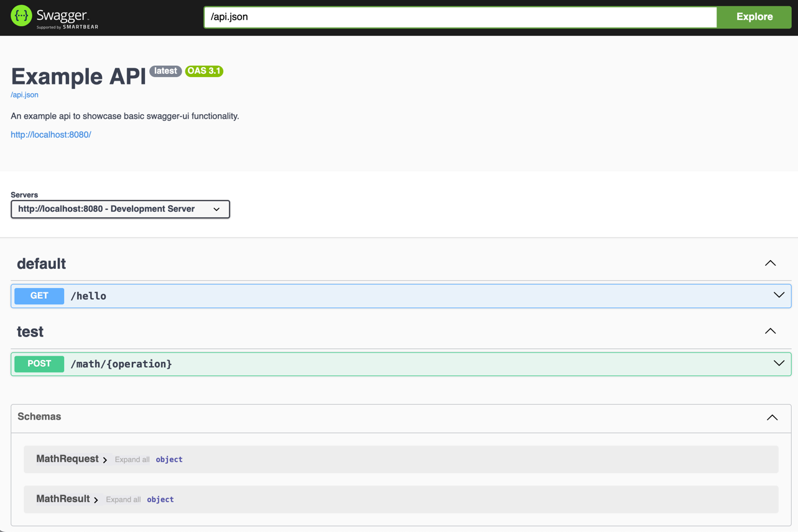
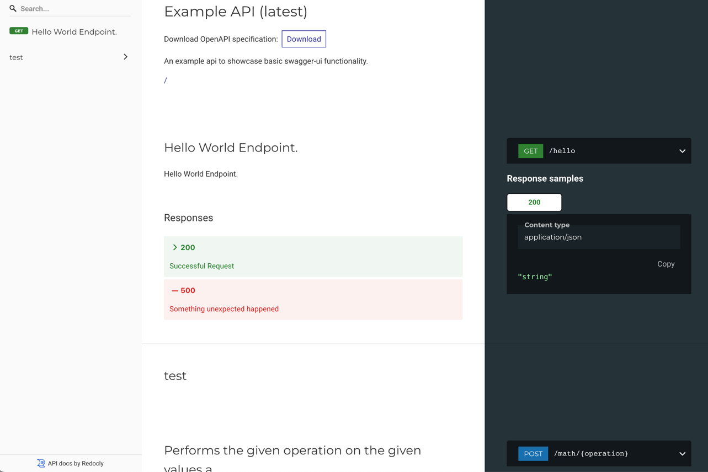

# Quickstart

## Installing and configuring the plugin

```kotlin
install(OpenApi) {
  info {
    title = "Example API"
    description = "An example api to showcase basic swagger-ui functionality."
  }
  server {
    url = "http://localhost:8080"
    description = "Development Server"
  }
}
```

## Routes

### Configure plugin routes

```kotlin
routing {
    // This following routes  will not be included in the spec
    
    // Create a route for the OpenAPI spec file.
    route("/api.json") {
      openApi()
    }
    // Create a route for swagger-ui using the openapi spec at "/api.json".
    route("/swagger") {
      swaggerUI("/api.json")
    }
    // Create a route for redoc
    route("/redoc") {
        redoc("/api.json")
    }
}
```

### Define your routes

```kotlin
get("hello", {
    description = "Hello World Endpoint."
    response {
        HttpStatusCode.OK to {
            description = "Successful Request"
            body<String> { description = "the response" }
        }
        HttpStatusCode.InternalServerError to {
            description = "Something unexpected happened"
        }
    }
}) {
    call.respondText("Hello World!")
}

post("math/{operation}", {
    tags = listOf("test")
    description = "Performs the given operation on the given values and returns the result"
    request {
        pathParameter<String>("operation") {
            description = "the math operation to perform. Either 'add' or 'sub'"
        }
        body<MathRequest>()
    }
    response {
        HttpStatusCode.OK to {
            description = "The operation was successful"
            body<MathResult> {
                description = "The result of the operation"
            }
        }
        HttpStatusCode.BadRequest to {
            description = "An invalid operation was provided"
        }
    }
}) {
    val operation = call.parameters["operation"]!!
    call.receive<MathRequest>().let { request ->
        when (operation) {
            "add" -> call.respond(HttpStatusCode.OK, MathResult(request.a + request.b))
            "sub" -> call.respond(HttpStatusCode.OK, MathResult(request.a - request.b))
            else -> call.respond(HttpStatusCode.BadRequest, Unit)
        }
    }
}
```

Add the schemas below

```kotlin
data class MathRequest(
    val a: Int,
    val b: Int
)

data class MathResult(
    val value: Int
)
```

## Result

Visit the routes you configured in [configure plugin routes section](#configure-plugin-routes) to see the output

=== "OpenAPI"
    ```json
    {
      "openapi" : "3.1.0",
      "info" : {
        "title" : "Example API",
        "description" : "An example api to showcase basic swagger-ui functionality.",
        "version" : "latest"
      },
      "externalDocs" : {
        "url" : "/"
      },
      "servers" : [ {
        "url" : "http://localhost:8080",
        "description" : "Development Server"
      } ],
      "tags" : [ ],
      "paths" : {
        "/hello" : {
          "get" : {
            "tags" : [ ],
            "description" : "Hello World Endpoint.",
            "parameters" : [ ],
            "responses" : {
              "200" : {
                "description" : "Successful Request",
                "headers" : { },
                "content" : {
                  "application/json" : {
                    "schema" : {
                      "type" : "string",
                      "title" : "String"
                    }
                  }
                }
              },
              "500" : {
                "description" : "Something unexpected happened",
                "headers" : { }
              }
            },
            "deprecated" : false
          }
        },
        "/math/{operation}" : {
          "post" : {
            "tags" : [ "test" ],
            "description" : "Performs the given operation on the given values and returns the result",
            "parameters" : [ {
              "name" : "operation",
              "in" : "path",
              "description" : "the math operation to perform. Either 'add' or 'sub'",
              "required" : true,
              "deprecated" : false,
              "explode" : false,
              "schema" : {
                "type" : "string",
                "title" : "String"
              }
            } ],
            "requestBody" : {
              "content" : {
                "application/json" : {
                  "schema" : {
                    "$ref" : "#/components/schemas/com.altin.plugins.MathRequest"
                  }
                }
              },
              "required" : false
            },
            "responses" : {
              "200" : {
                "description" : "The operation was successful",
                "headers" : { },
                "content" : {
                  "application/json" : {
                    "schema" : {
                      "$ref" : "#/components/schemas/com.altin.plugins.MathResult"
                    }
                  }
                }
              },
              "400" : {
                "description" : "An invalid operation was provided",
                "headers" : { }
              }
            },
            "deprecated" : false
          }
        }
      },
      "components" : {
        "schemas" : {
          "com.altin.plugins.MathRequest" : {
            "type" : "object",
            "properties" : {
              "a" : {
                "type" : "integer",
                "format" : "int32",
                "title" : "Int"
              },
              "b" : {
                "type" : "integer",
                "format" : "int32",
                "title" : "Int"
              }
            },
            "required" : [ "a", "b" ],
            "title" : "MathRequest"
          },
          "com.altin.plugins.MathResult" : {
            "type" : "object",
            "properties" : {
              "value" : {
                "type" : "integer",
                "format" : "int32",
                "title" : "Int"
              }
            },
            "required" : [ "value" ],
            "title" : "MathResult"
          }
        },
        "examples" : { }
      }
    }
    ```

=== "Swagger UI"
    

=== "ReDoc"
    
